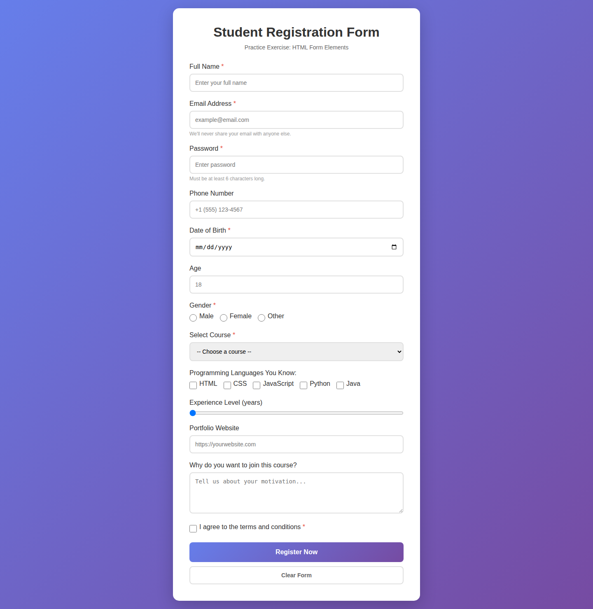
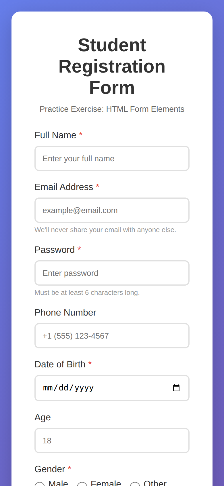

# Student Registration Form — HTML Forms Exercise

An exercise for students learning HTML forms: a styled registration form that uses most HTML input types.

## What's inside

- Text, email, password, tel, number, date, url, and range inputs
- Radio buttons, checkboxes, select menu, and textarea
- Required fields and helper text
- Submit and reset buttons
- Gradient background with a centered card

## Built with

- HTML form elements and validation attributes
- CSS

## Run locally

No build step. Open `index.html` in a browser.
